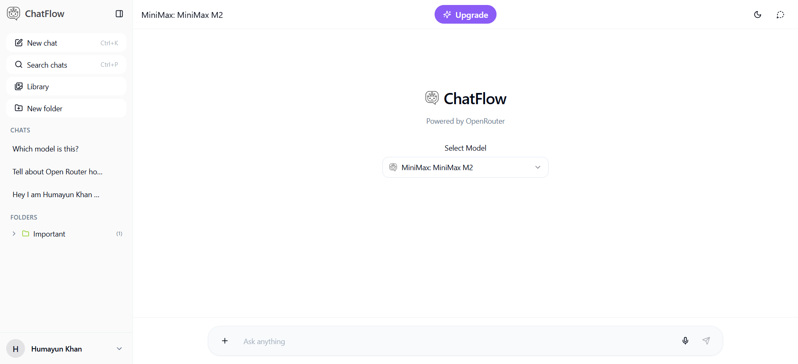

# ChatFlow 💬

<div align="center">

**A modern, feature-rich AI chat assistant powered by OpenRouter**

[](https://react.dev/)
[](https://www.typescriptlang.org/)
[](https://vitejs.dev/)
[](https://tailwindcss.com/)

</div>

<div align="center">



</div>

---

## ✨ Features

### Core Functionality
- 🤖 **Multiple AI Models** - Switch between various AI models supported by OpenRouter
- 💬 **Real-time Chat** - Stream responses with smooth typing indicators
- 📝 **Code Highlighting** - Beautiful syntax highlighting with copy-to-clipboard
- 💾 **Chat History** - Persistent chat history with localStorage
- 🔄 **Response Regeneration** - Regenerate AI responses with a single click
- 🎯 **Model Switching** - Change AI models mid-conversation

### User Experience
- 🎨 **Modern UI** - Clean, intuitive interface built with shadcn/ui
- 🌓 **Theme Support** - Dark and light mode with system preference detection
- 📱 **Responsive Design** - Fully responsive across all devices
- 🔍 **Chat Search** - Quickly find conversations in your chat history
- 📋 **Copy Messages** - Copy individual messages or entire conversations
- 🏷️ **Chat Management** - Rename, archive, delete, and organize your chats

### Developer Experience
- ⚡ **Fast Development** - Hot module replacement with Vite
- 🔒 **Type Safety** - Full TypeScript support
- 🎯 **Modular Architecture** - Clean, maintainable code structure
- 📦 **Easy Configuration** - Simple API key and model configuration

---

## 🚀 Quick Start

### Prerequisites

- **Node.js** v18.0.0 or higher
- **npm** v9.0.0 or higher (or yarn/pnpm)

### Installation

1. **Clone the repository**
   ```bash
   git clone https://github.com/HumayunK01/ChatFlow.git
   cd ChatFlow
   ```

2. **Install dependencies**
   ```bash
   npm install
   ```

3. **Configure your API keys**
   
   Create a `.env` file in the root directory:
   ```env
   VITE_OPENROUTER_API_KEY=your_api_key_here
   ```
   
   Or configure multiple API keys in `src/config/apiKeys.ts`:
   ```typescript
   export const API_KEYS: ApiKeyConfig[] = [
     {
       name: 'Primary',
       key: 'your-api-key-here',
       models: ['openai/gpt-4', 'anthropic/claude-3-opus']
     }
   ];
   ```

4. **Start the development server**
   ```bash
   npm run dev
   ```

5. **Open your browser**
   
   Navigate to [http://localhost:8080](http://localhost:8080)

---

## 📖 Usage

### Starting a New Chat

1. Click the **"New Chat"** button in the sidebar (or press the + icon)
2. Select your preferred AI model from the dropdown in the top bar
3. Start typing your message in the input field
4. Press Enter or click the send button to send your message

### Managing Chats

- **Rename**: Click the edit icon next to a chat in the sidebar
- **Archive**: Use the archive button to organize your chats
- **Delete**: Remove chats you no longer need
- **Search**: Use the search bar to quickly find specific conversations

### Code Blocks

Code blocks automatically detect the programming language and provide:
- Syntax highlighting
- Copy-to-clipboard functionality
- Full-width display for better readability

### Model Switching

You can switch AI models at any time:
1. Click the model selector in the top bar
2. Choose your desired model
3. Continue the conversation with the new model

---

## 🛠️ Technology Stack

### Core Technologies
- **[Vite](https://vitejs.dev/)** - Next-generation frontend build tool
- **[React](https://react.dev/)** - UI library for building user interfaces
- **[TypeScript](https://www.typescriptlang.org/)** - Typed JavaScript for better development experience
- **[Tailwind CSS](https://tailwindcss.com/)** - Utility-first CSS framework

### UI Components
- **[shadcn/ui](https://ui.shadcn.com/)** - Beautiful, accessible component library
- **[Radix UI](https://www.radix-ui.com/)** - Unstyled, accessible component primitives
- **[Lucide React](https://lucide.dev/)** - Beautiful icon library

### Key Libraries
- **[React Markdown](https://github.com/remarkjs/react-markdown)** - Markdown rendering
- **[React Syntax Highlighter](https://github.com/react-syntax-highlighter/react-syntax-highlighter)** - Code syntax highlighting
- **[React Router](https://reactrouter.com/)** - Client-side routing
- **[next-themes](https://github.com/pacocoursey/next-themes)** - Theme management

### API Integration
- **[OpenRouter](https://openrouter.ai/)** - Unified API for accessing multiple AI models

---

## 📁 Project Structure

```
ChatFlow/
├── public/                 # Static assets
├── src/
│   ├── components/        # React components
│   │   ├── ui/           # shadcn/ui components
│   │   ├── ChatInterface.tsx
│   │   ├── ChatMessage.tsx
│   │   ├── ChatSidebar.tsx
│   │   └── ChatTopBar.tsx
│   ├── config/           # Configuration files
│   │   └── apiKeys.ts    # API key configuration
│   ├── hooks/            # Custom React hooks
│   │   └── use-toast.ts
│   ├── lib/              # Utility functions
│   │   ├── localStorage.ts
│   │   └── openrouter.ts
│   ├── pages/            # Page components
│   │   └── Index.tsx
│   ├── types/            # TypeScript definitions
│   │   └── chat.ts
│   ├── App.tsx           # Root component
│   ├── main.tsx          # Entry point
│   └── index.css         # Global styles
├── .env.example          # Environment variables template
├── index.html            # HTML template
├── package.json          # Dependencies and scripts
├── tailwind.config.ts    # Tailwind configuration
├── tsconfig.json         # TypeScript configuration
└── vite.config.ts        # Vite configuration
```

---

## ⚙️ Configuration

### Environment Variables

Create a `.env` file in the root directory:

```env
# OpenRouter API Key
VITE_OPENROUTER_API_KEY=your_api_key_here
```

### API Keys Configuration

For more advanced setups, configure multiple API keys in `src/config/apiKeys.ts`:

```typescript
import { ApiKeyConfig } from '@/types/chat';

export const API_KEYS: ApiKeyConfig[] = [
  {
    name: 'Primary Key',
    key: process.env.VITE_OPENROUTER_API_KEY || '',
    models: [
      'openai/gpt-4',
      'openai/gpt-3.5-turbo',
      'anthropic/claude-3-opus',
      'anthropic/claude-3-sonnet'
    ]
  },
  {
    name: 'Secondary Key',
    key: 'another-api-key',
    models: ['meta-llama/llama-3-70b-instruct']
  }
];
```

### Supported Models

ChatFlow supports all models available through OpenRouter, including:
- OpenAI (GPT-4, GPT-3.5)
- Anthropic (Claude 3 Opus, Sonnet, Haiku)
- Meta (Llama 3)
- Google (Gemini Pro)
- And many more...

See the [OpenRouter Models page](https://openrouter.ai/models) for a complete list.

---

## 📜 Available Scripts

| Command | Description |
|---------|-------------|
| `npm run dev` | Start development server with hot reload |
| `npm run build` | Build for production |
| `npm run build:dev` | Build for development environment |
| `npm run preview` | Preview production build locally |
| `npm run lint` | Run ESLint to check code quality |

---

## 🎨 Customization

### Themes

The app supports both light and dark themes. The theme automatically follows your system preference, but you can customize it in `src/index.css`.

### Styling

- **Tailwind CSS**: Modify `tailwind.config.ts` for theme customization
- **Colors**: Update color variables in `src/index.css`
- **Components**: Customize shadcn/ui components in `src/components/ui/`

### Adding New Models

1. Ensure your API key has access to the model
2. Add the model ID to your API key configuration in `src/config/apiKeys.ts`
3. The model will automatically appear in the model selector

---

## 🐛 Troubleshooting

### API Key Issues

**Problem**: "Invalid API key" error  
**Solution**: 
- Verify your API key is correct in `.env` or `src/config/apiKeys.ts`
- Ensure the API key has sufficient credits
- Check that the model is available with your API key

### Models Not Loading

**Problem**: Models don't appear in the selector  
**Solution**:
- Check your internet connection
- Verify your API key has access to fetch available models
- Check the browser console for errors

### Chat History Not Saving

**Problem**: Chats disappear after refresh  
**Solution**:
- Check browser localStorage is enabled
- Clear browser cache and try again
- Check browser console for storage errors

---

## 🤝 Contributing

Contributions are welcome! Please feel free to submit a Pull Request.

1. Fork the repository
2. Create your feature branch (`git checkout -b feature/AmazingFeature`)
3. Commit your changes (`git commit -m 'Add some AmazingFeature'`)
4. Push to the branch (`git push origin feature/AmazingFeature`)
5. Open a Pull Request

---

## 📝 License

This project is licensed under the MIT License - see the LICENSE file for details.

---

## 🙏 Acknowledgments

- [OpenRouter](https://openrouter.ai/) for providing unified AI model access
- [shadcn](https://ui.shadcn.com/) for the beautiful component library
- [Vite](https://vitejs.dev/) team for the amazing build tool
- All the amazing open-source libraries that make this project possible

---

## 📧 Support

For issues, questions, or suggestions:
- Open an issue on GitHub
- Check existing issues for solutions

---

<div align="center">

**Made with ❤️ using React, TypeScript, and Tailwind CSS**

⭐ Star this repo if you find it helpful!

</div>
